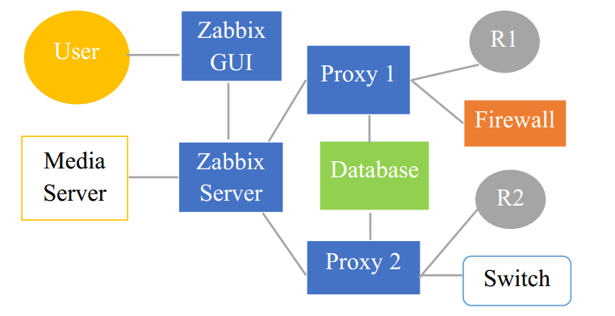
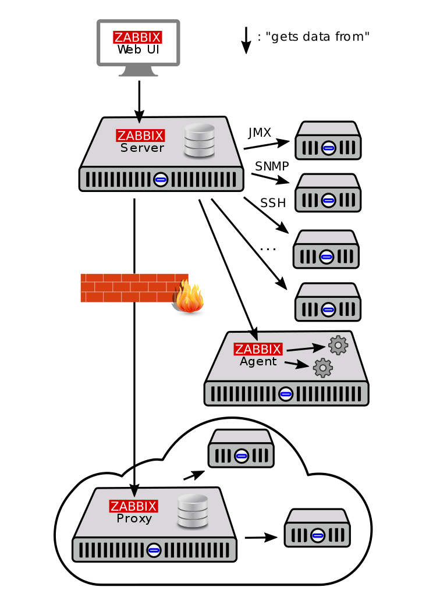

# Zabbix

Zabbix là 1 công cụ để giám sát hệ thống mạng, các thiết bị mạng, giám sát khả năng sẵn sàng và hiệu năng của mạng và thiết bị mạng. Nếu có xảy ra lỗi thì sẽ có cảnh báo gửi tới người quản trị mạng qua sms, email...

Là công cụ mã nguồn mở miễn phí

Được phát hành theo giấy phép GPIv2, không giới hạn về sức chứa và số lượng thiết bị được giám sát

Hỗ trợ bất kỳ kích thước của mô hình mạng nào. Có thể là mô hình nhỏ hoặc mô hình lớn, thường xuyên cập nhật và phát hành phiên bản mới

Zabbix được viết năm 1998, là dự án của Alexei Vlandishev (Alexei Vladishev dùng để monitor hệ thống database)

## Tính năng của Zabbix

Zabbix cung cấp những tính năng quan trọng và cần thiết cho việc monitor hệ thống và các thiết bị mạng

Zabbix dựa trên các agent và agentless để giám sát hệ thống mạng và các thiết bị mạng. Các thiết bị mạng phải hỗ trợ giao thức SNMP. Zabbix giám sát hiệu suất, hiệu năng của máy chủ vật lý cũng như máy ảo

Trong trường hợp có lỗi xảy ra Zabbix cảnh báo cho người quản trị, tuy nhiên Zabbix không có khả năng phát hiện hay dự đoán lỗi có thể xảy ra

**Mã nguồn mở!**

**Agent-based và Agentless:**
- Agent-based:
    - Đây là 1 phần mềm được gọi là agent được cài đặt trên máy chủ local và các thiết bị cần monitor. Mục tiêu của nó là thu thập thông tin gửi về zabbix-server và có thể cảnh báo tới người quản trị
    - Agent được cài đặt đơn giản nhẹ nhàng, tiêu thụ ít tài nguyên của server
    - Lợi ích của việc sử dụng agent là phân tích sâu hơn, ngoài ra có thể chuẩn đoán đc hiệu suất phần cứng, cung cấp khả năng cảnh báo và report
- Agentless:
    - Agentless là 1 giải pháp không yêu cầu bất kỳ cài đặt agent riêng biệt nào. Phân tích mạng dựa trên giám sát package trực tiếp
    - Dựa trên giao thức SNMP hoặc WMI: 1 trạm quản lý trung tâm, giám sát tất cả các thiết bị mạng khác
    - Việc cài đặt không ảnh hưởng đến hiệu suất của server. Quá trình triển khai dễ dàng hơn, không phải cập nhật thường xuyên từ các agent. Tuy nhiên lại không đi sâu thu thập được các số liệu, không cung cấp khả năng phân tích và báo cáo
    - Trong khi zabbix-agent cung cấp những tính năng tuyệt vời trên 1 số nền tảng, nhưng cũng có trường hợp cơ nhũng nền tảng không thể cài đặt được nó. Đối với trường hợp này, phương thức agentless được cung cấp bởi zabbix server

**Tính năng của Agentless:**
- ```Network Services Check```: Zabbix server có thể kiểm tra 1 service đang lắng nghe trên port nào hoặc chúng phản hồi có đúng không. Phương thức này hiện tại support cho 1 số service như: FTP, IMAP, HTTP, HTTPS, LDAP, NNTP, POP3, SMTP, SSH, TCP và Telnet. Đối với các trường hợp không được xử lý bởi mục trước đó, Zabbix server có thể kiểm tra xem có gì đang lắng nghe trên cổng TCP hay không, thông báo nếu 1 dịch vụ có sẵn hay không. Tóm lại có 3 chức năng: **TCP port availability**, **TCP port response time** và **Service check**
- ```ICMP Ping```: mặc dù đơn giản nhưng quan trọng, Zabbix có thể kiểm tra xem máy chủ có đang phản hồi các gói ping ICMP hay không. Vì vậy, nó có thể kiểm soát sự sẵn sàng của 1 máy chủ, cũng như thời gian phản hồi và mất gói tin. Kiểm tra có thể được tùy chỉnh bằng cách thiết lập kích thước và số lượng gói tin, thời gian chờ và độ trễ giữa mỗi gói. Tiếp tục túm lại là: **Server availability**, **ICMP response time**, **Package loss**
- ```Remote Check```: khi cấu hình agent zabbix không hỗ trợ, nhưng truy cập thông qua SSH hoặc Telnet sẵn sàng, một máy chủ Zabbix có thể chạy bất kỳ lệnh tùy chỉnh nào và sử dụng lệnh trả về của nó như là 1 giá trị được thu thập. Từ giá trị này có thể làm nhiều thứ như tạo ra các đồ thị và cảnh báo. Chức năng này gọi là **Executing commands via SSH or Telnet**

**Auto discovery:**

- Hệ thống được cập nhật khi nó có sự thay đổi. Các thiết bị mới được thêm vào cần được tự động phát hiện. Tính năng theo dõi sự thay đổi môi trường liên tục được gọi là **Auto discovery**
- Đây là 1 tính năng cho phép thực hiện tìm kiếm các phần tử mạng. Ngoài ra, nó sẽ tự động thêm các thiết bị mới và loại bỏ các thiết bị không còn là 1 phần của mạng. Nó cũng thực hiện việc khám phá các network interface, các port và các hệ thống file
- Auto discovery có thể được sử dụng để tìm ra trạng thái hiện tại trong mạng. Nếu mạng có Hệ thống Phát hiện xâm phạm (IDS), tính năng phát hiện tự động có thể kích hoạt báo động xâm nhập
- Phát hiện tự động đóng 1 phần thiết yếu trong giám sát mạng, 1 số công cụ khác không cung cấp tính năng này. Đó là lý do tại sao các quản trị mạng nên chú ý auto discovery khi chọn công cụ giám sát mạng

**Low-level discovery:**

- Low-level discovery (LLD) được sử dụng để giám sát các hệ thống file và interface mà không cần tạo và thêm thủ công từng phần tử. LLD là 1 tính năng tự động thêm và xóa các phần tử. Nó cũng tự động tạo ra triggers, graphs cho file systems, network interface và SNMP tables

**Trend Prediction:**

- Một số công cụ theo dõi mạng có 1 tính năng dự đoán. Nó được sử dụng để phát hiện 1 lỗi trước khi nó xảy ra. Điều này được thực hiện bằng cách thu thập dữ liệu về băng thông mạng và trạng thái của các thiết bị theo mức độ hoạt động. Tất cả các thông tin được lưu trữ trong CSDL SQL. Các kết quả giám sát tiếp theo được so sánh với thông tin được lưu trữ trong cơ sở dữ liệu. Nếu một số thay đổi giữa dữ liệu đã được tìm thấy, giám sát mạng sẽ tạo ra 1 cảnh báo
- Trend Prediction cho phép phát hiện vấn đề trước, để quản trị viên mạng có thể giải quyết nó trước khi người dùng cuối nhận thấy nó. Mặc dù tính năng này hay nhưng hầu hết các sản phẩm vẫn không hỗ trợ tính năng này

**Logical grouping:**

- Trong các mạng lớn bao gồm nhiều thiết bị, khó để theo dõi và khắc phục tất cả các thiết bị trong quá trình giám sát mạng. Logical grouping cho phép kết hợp cùng 1 loại thiết bị lại với nhau. Kết quả là logical grouping giúp việc giám sát các mạng cấp doanh nghiệp dễ dàng hơn đáng kể
- Logical grouping cho phép kết hợp cùng 1 loại thiết bị mạng thành các nhóm. Đối với mỗi nhóm có thể được xác định những gì cần được theo dõi và những hành động nên được thực hiện trong trường hợp xảy ra lỗi. Ngoài ra, với việc logical grouping có thể định cấu hình cài đặt hợp nhất cho tất cả phần tử của nhóm. Nếu 1 hoặc nhiều phần tử của nhóm ngừng hoạt động 1 cảnh báo sẽ được hiển thị
- Có thể tạo các nhóm lồng nhau cho các mạng lớn. Điều này có nghĩa là các nhóm có thể được tạo bên trong 1 nhóm khác. Kết quả là, việc quản lý các thiết bị mạng bên trong 1 mạng lớn trở nên dễ dàng hơn

## Zabbix architecture



Zabbix bao gồm các thành phần sau: Zabbix Server, Zabbix Proxy, Zabbix Agent và Web Interface
- Zabbix Server: đây là thành phần trung tâm của phần mềm Zabbix. Zabbix Server có thể kiểm tra các dịch vụ mạng từ xa thông qua các báo cáo của Agent gửi về cho Zabbix Server và từ đó nó sẽ lưu trữ tất cả các cấu hình cũng như là số liệu thống kê
- Zabbix Proxy: là phần tùy chọn của Zabbix có nhiệm vụ thu nhận dữ liệu, lưu trong bộ nhớ đệm và chuyển đến Zabbix Server
- Zabbix Agent: giám sát chủ động các thiết bị cục bộ và các ứng dụng (ổ cứng, bộ nhớ...) trên hệ thống mạng. Zabbix Agent sẽ được cài lên trên Server và từ đó Agent sẽ thu thập thông tin hoạt động từ Server mà nó đang chạy và báo cáo dữ liệu này đến Zabbix Server để xử lý
- Web Interface: để dễ dàng truy cập dữ liệu theo dõi và sau đó cấu hình từ giao diện web cung cấp



## Ưu điểm của Zabbix

- Zabbix đáp ứng các yêu cầu của công cụ giám sát mạng đáng tin cậy tới 90%. Nó thực hiện cả giám sát agent-based, agentless. Hỗ trợ Low-level discovery, auto-discovery, logical grouping. Tất cả các tính năng nêu trên làm cho Zabbix trở thành 1 công cụ giám sát mạng hoàn hảo, đáp ứng đầy đủ các yêu cầu của bất kỳ mạng kích thước nào. Tuy nhiên Zabbix không hỗ trợ dự đoán TH xấu xảy ra

Zabbix là 1 công cụ giám sát mạng đáng tin cậy, nếu zabbix cảnh báo người dùng về 1 lỗi nào đó, 100% là vấn đề đó tồn tại. Ngoài ra, 1 trong những lợi thế chính của Zabbix là khả năng mở rộng của nó vì nó có thể áp dụng cho môi trường có kích thước bất kỳ

## Vấn đề cần cải thiện trong Zabbix

- Web Interface: thao tác sử dụng hiện tại của giao diện người dùng quá phức tạp. Người dùng Zabbix mới có thể gặp khó khăn với giao diện web. 1 số thao tác cơ bản có thể tốn thời gian ngay cả đối với người dùng có kinh nghiệm. Phải thao tác quá nhiều cho 1 hoạt động cơ bản

- API có thể có hiện tượng rất chậm, đặc biệt khi nói đến các hoạt động template linking. Ví dụ, có 10000 host và quản lý 1 mạng muốn liên kết chúng thành 1 template đơn giản. Nó sẽ mất khoảng 10-20p, tùy thuộc vào phần cứng. Ngoài ra, nó sẽ tạo ra quá nhiều truy vấn SQL. Số lượng thậm chí có thể đạt tới hàng triệu