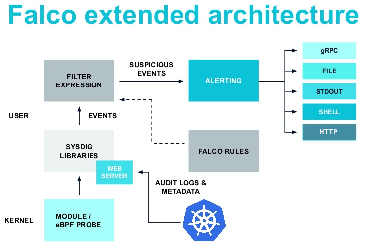

# Falco trong Kubernetes

Falco là một công cụ mã nguồn mở phát hiện rủi ro và các mối đe dọa tốt nhất trên K8s, containers, cloud & on-premise. Falco được ví như một camera an ninh, liên tục phát hiện các hành vi đáng ngờ, các thay đổi về cấu hình, xâm nhập và đánh cắp dữ liệu. Dự án ban đầu được Sysdig, Inc tạo ra vào năm 2016. Sau đó thì Falco được đóng góp cho CNCF để tiếp tục phát triển.

Chức năng của Falco:
- Phát hiện và cảnh báo các hành vi liên quan tới thay đổi namespace Kubernetes
- Phát hiện và cảnh báo đặc quyền liên quan tới privileged trong containers
- Phát hiện hành vi đọc/ghi vào các thư mục /etc, /usr/bin, /usr/sbin,...
- Phát hiện việc tạo các symlinks
- Phát hiện hành vi thay đổi quyền sở hữu
- Phát hiện kết nối bất thường
- Phát hiện các hành vi thực thi executing shell dùng sh, bash, csh, zsh,...
- Phát hiện hành vi excuting SSH dùng ssh, scp, sftp,...
- Phát hiện hành vi thực thi coreutils (touch, whoami, curl,...)
- Phát hiện thay đổi thông tin login
- Phát hiện spawned processes sử dụng execve
- Phát hiện và cảnh báo việc sửa đổi shadowutil hoặc passwd qua thực thi shadowconfig, pwck, chpasswd, getpasswd, change, useradd,...

Auditd là một giải pháp tương tự với Falco, hãy thử so sánh chúng với nhau

|Auditd|Falco|
|:-|:-|
|- Auditd chỉ triển khai được trên Host/OS|- Falco hoạt động trên cả Host/OS, Cotainers, K8s|
|- Auditd cần phải giải mã logs để đọc được một số thông tin|- Falco được đẩy ra dạng clear text rõ ràng hơn|
|- Auditd một rule dùng kích hoạt cho nhiều sự kiện, dễ dẫn tới nhiều cảnh báo rác|- Falco một rule chỉ để kích hoạt một sự kiện duy nhất giúp phát hiện chính xác vấn đề alert|
|- Triển khai trên Host/OS dễ ảnh hưởng tới các service đang chạy|- Falco rules cú pháp đơn giản và dễ hiểu|

## Kiến trúc và rules



Về cơ bản thì Falco được chia làm 3 thành phần chính:
- Module eBPF: tương tác với kernel hệ thống ghi lại các thao tác liên quan tới: chạy lệnh gì, thông tin ra sao, gọi tới hàm nào,...
- Filter Expression: cung cấp bộ module rule engine thực hiện chức năng lọc ra các thông tin sự kiện và xuất ra logs. Falco rule là 1 file yaml chứa các thành phần:
  - rule: tên rules
  - condition: filtering expression áp dụng cho event để xem có khớp với rules hay không
  - desc: mô tả của rule
  - output: đầu ra cho cảnh báo
  - priority: mức độ nghiêm trọng của hành vi
  - exceptions: ngoại lệ để rules không tạo cảnh báo
  - enabled: nếu set true thì rule sẽ được bật
  - tags: đánh dấu rule
  - warn_evttypes: nếu set false thì hệ thống sẽ bỏ qua các quy tắc không có event_type
  - skip-if-unknown-filter: nếu set true, nếu một rules chứa bộ lọc thì rule sẽ được áp dụng nhưng không thực hiện
  - source: chọn nguồn cho event

```sh
- rule: shell_in_container
  desc: notice shell activity within a container
  condition: evt.type = execve and evt.dir=< and container.id != host and proc.name = bash
  output: shell in a container (user=%user.name container_id=%contaner.id container_name=%container.name)
  priority: WARNING
```

- Alerting: Falco có 5 đầu ra cho các event của nó: stdout, file, gRPC, shell và http. Thêm vào đó có thể sử dụng công cụ Falcosidekick để mở rộng output

## Triển khai Falco trên Kubernetes

